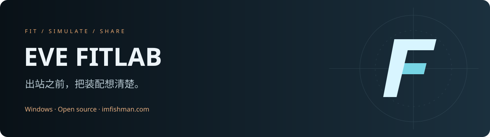
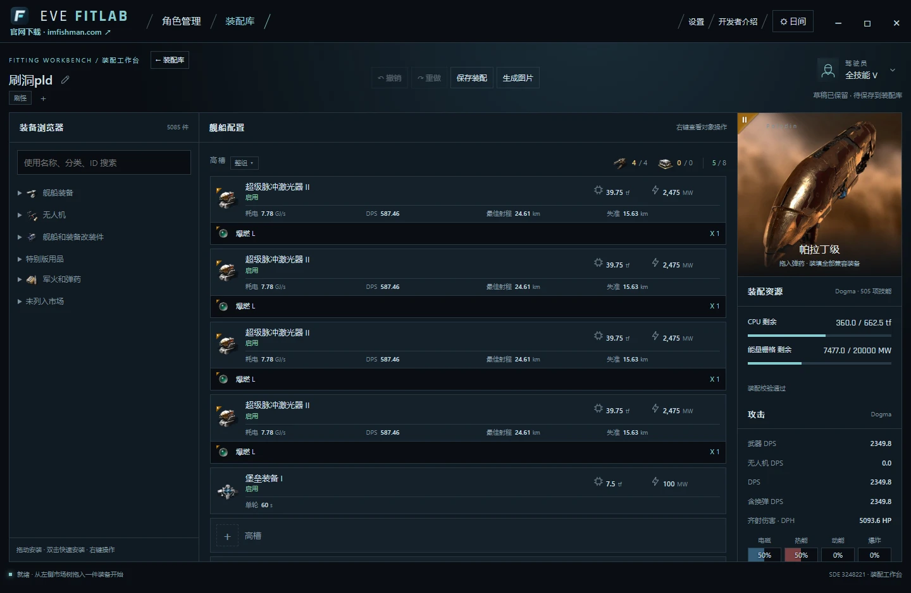
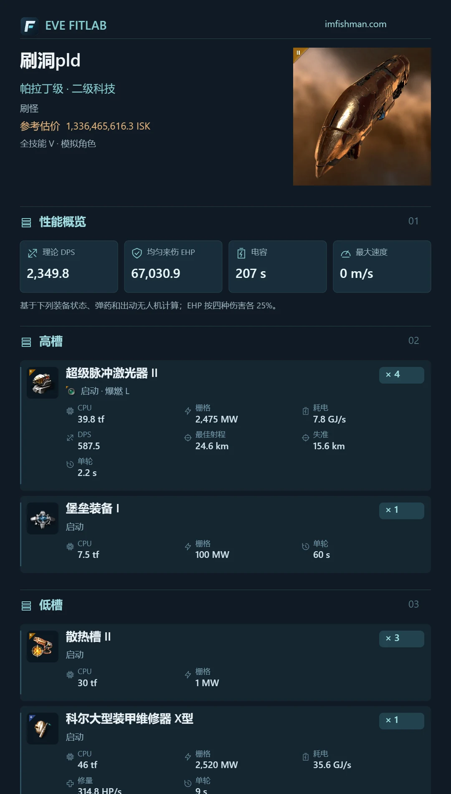

<p align="center"></p>
<p align="center"><strong>为新伊甸的每一次出航，准备一套更好的装配。</strong></p>
<p align="center">
<a href="https://imfishman.com/">🌐 官网与下载</a> · <a href="#-支持开发">💛 支持开发</a> · <a href="https://github.com/TDGOTT-K/EVE-FitLab/issues">💬 反馈与建议</a> · <a href="docs/README.en.md">English</a>
</p>
<p align="center"></p>

**EVE FitLab** 是一款为 EVE Online 玩家打造的 Windows 舰船装配工作台。把装配构思、角色技能、性能计算和图片分享放在一起，让每一个槽位都有理由。

> **下载请认准 [imfishman.com](https://imfishman.com/)。** 首个公开测试版 **0.1.2-beta.1** 已发布：[选择版本并下载](https://imfishman.com/download) · [GitHub Release](https://github.com/TDGOTT-K/EVE-FitLab/releases/tag/v0.1.2-beta.1)。这是测试版，尚未代码签名，可能存在问题；重要装配请保留备份。

## 💛 支持开发

<p align="center"></p>
<p align="center"><strong>Token 太贵了，救救孩子吧！🥺</strong></p>

我是 **深海的鱼**，游戏 ID **ImFishMan**。这个项目在持续迭代，AI 开发和反复验证都需要真金白银的 Token。如果 FitLab 帮你配出了一艘好船，欢迎投喂一点开发燃料，让下一个功能更早到来。

- **赞助方式：USDT · TRON（TRC20）**
- **地址：`TYDiRLFWukWdHpiZKQdGLoX7ivH2PFtPBS`**
- **[查看赞助二维码与说明 →](SPONSOR.md)**

Star、分享给军团朋友、认真提一个 Issue，同样是非常有用的支持。赞助完全自愿，不影响开源代码的使用，也不代表付费服务或功能交付承诺。

## 一眼看看工作台



## 能做什么

| 功能 | 你可以做的事 |
| --- | --- |
| 🛠 装配工作台 | 高中低槽、改装件、T3 子系统、无人机与货舱统一管理；拖放预览、Shift 多选、整组操作、撤销与重做 |
| 📊 性能计算 | CPU / 能量栅格余量、DPS、抗性、HP / EHP、机动、电容稳定性，以及吸电与注电收益 |
| 🎯 可视化靶标 | 用其他装配作为靶标，调整位置和速度矢量，观察距离与角速度；配置外部支援 |
| 👤 角色技能 | EVE SSO 技能导入、自定义技能等级和文件夹管理；内置全技能 V / 无技能对照 |
| 🗂 装配库 | 舰船选择树、标签筛选、备注、参考估价、复制与粘贴 |
| 🖼 图片分享 | 导出详细装配长图；通过图中的装配二维码重新导入配置 |
| 🌏 本地化 | 简体中文、繁体中文、英语、日语；官网也提供四种语言 |
| 🖥 Windows 桌面 | 自定义窗口、原生文件夹选择、本地数据目录管理 |

### 好装配，值得分享

<p align="center"></p>

长图包含舰船、装备、计算参数与装配码；导入时读取装配码，还原成一份新的配置。图片识别在本地进行。压缩、二次截图后能否还原，取决于二维码是否仍然清晰完整；不是对任意图片做 OCR，也不保证严重损坏的图片能恢复。

## 本地开发

需要 **Python 3.9+、Node.js / npm、.NET 9 SDK**。计算引擎源码已放在 `engine/`，无需另找旧项目。

1. 克隆仓库并安装前端/桌面构建依赖：

   ```powershell
   git clone https://github.com/TDGOTT-K/EVE-FitLab.git
   cd EVE-FitLab
   npm ci
   ```

2. 从 [CCP 官方静态数据说明](https://developers.eveonline.com/docs/services/static-data/) 获取并解压 **JSONL SDE**。当前随仓库生成的数据对应 **3248221**；使用其他版本需重新生成应用数据并核对计算结果。SDE 是大型游戏数据，不包含在 Git 源码仓库内。

3. 启动本地网页开发服务：

   ```powershell
   $env:FITLAB_SDE_ROOT = 'D:\EVE-SDE\eve-online-static-data-3248221-jsonl'
   python run.py
   ```

   打开 `http://127.0.0.1:5207/`。开发服务使用 5207 / 5210，请先关闭占用这些端口的旧服务。

构建 Windows 安装包见 [桌面构建说明](desktop/README.md)。官网源文件与四语言设计稿位于 `website-design/`，本地预览：`python -m http.server 5217 --directory website-design`。

## 验证与贡献

```powershell
python -m unittest test_server test_characters test_storage_location test_capacitor test_scenario test_linked_scenario test_calculation_graph -q
npm run test:share-code
npm run check:locales
dotnet build desktop/engine/FitLab.Engine.csproj
```

欢迎提交问题、翻译改进和 PR。先读 [贡献指南](CONTRIBUTING.md)；安全问题请按 [安全说明](SECURITY.md) 私下报告。装配计算问题最好附上舰船、装备、技能条件、预期值与实际值。

## 当前边界

项目仍在快速开发。未完整模拟战斗时序、无人机追击与碰撞、导弹加速/拦截；外部传电尚未联算来源舰船缺电后的停机。EVE SSO 已接入 PKCE，但仍需真实账号端到端验证。桌面代码签名与自动更新尚未配置。计算与市场估价供装配规划参考。

## 作者与联系

- **作者：深海的鱼 · EVE ID：ImFishMan**
- **邮箱：[wzx2377951590@gmail.com](mailto:wzx2377951590@gmail.com)**
- **QQ：2377951590**
- **开发工具：GPT-6-Astra**
- **官网：[imfishman.com](https://imfishman.com/)**

欢迎建议，也欢迎来聊聊你的装配想法。

## 许可与致谢

本项目原创代码采用 [MIT License](LICENSE)。EVE Online、游戏图标与静态数据的权利归 CCP Games 所有，不因本项目的 MIT 许可而改变。第三方依赖各自保留原许可证，详见 [第三方声明](THIRD_PARTY_NOTICES.md)。这是独立玩家项目，与 CCP Games 无隶属、背书或赞助关系。
