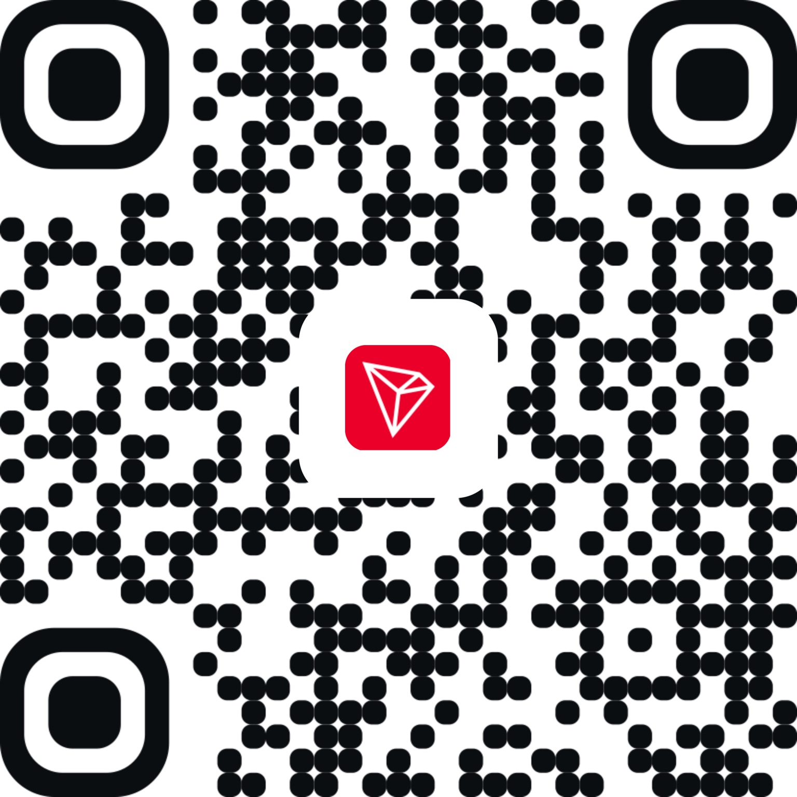

# 💛 给 FitLab 加一点开发燃料

[← 回到项目](README.md) · [官网](https://imfishman.com/)

<p align="center"></p>
<h2 align="center">Token 太贵了，救救孩子吧！🥺</h2>

我是 **深海的鱼 / ImFishMan**。想把 EVE FitLab 打磨成一个好用、直观、能分享想法的舰船装配工具。开发依靠 GPT-6-Astra 辅助，持续改功能、修计算和验证体验，都在消耗 Token。

如果它帮到了你，欢迎赞助一点开发燃料。你的支持会帮助我承担 AI 开发和项目维护的开销。**赞助自愿，源码照常开放；不捆绑功能，不承诺回报或交付时间。**

## USDT · TRON（TRC20）

请确认使用 **TRON / TRC20 网络**，并核对完整地址：

```text
TYDiRLFWukWdHpiZKQdGLoX7ivH2PFtPBS
```

<p align="center"></p>

不方便赞助也完全没关系。给仓库点一个 **Star**、分享给军团朋友、报告一个可复现的问题，或者帮忙改进翻译，都能让项目变得更好。

## 联系我

- 游戏 ID：**ImFishMan**
- 邮箱：**wzx2377951590@gmail.com**
- QQ：**2377951590**

欢迎建议，感谢每一位愿意帮忙的舰长。

---

## Support EVE FitLab

**Tokens are expensive… spare a little fuel? 🥺**

I’m ImFishMan, the developer of EVE FitLab. If this tool helps you, consider supporting its AI-assisted development and maintenance. Donations are optional and do not purchase features, services or delivery commitments.

**USDT on TRON (TRC20)** — use the address and QR code above. Stars, bug reports, translations and sharing the project with your fleet are equally appreciated. Thank you!
