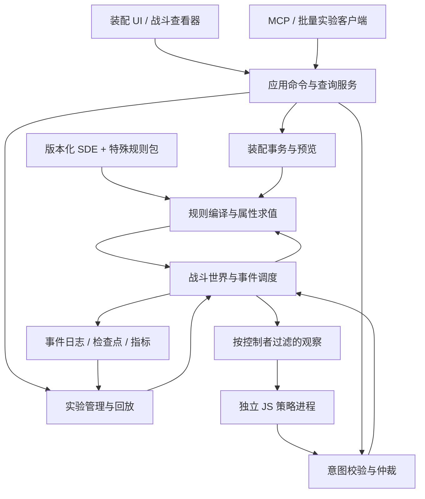

# FitLab Engine V2：完整重写设计

状态：设计基线 v0.3，2026-09-14。已纳入范围攻击、飞行物、预热、次级攻击、模式切换及复杂电子战闭环；尚未实现的新架构，性能数字是待验证目标。

## 方向与依据

用户已决定完整重写计算引擎。本设计据此建立新实现，不再以修补旧 C#/Python 数值链路为目标。旧代码、装配样本和审查记录用于提取需求、反例及迁移对照，不作为新引擎正确性标准。UI 是否迁移 Qt 是独立决策，新后端不依赖 Electron、Qt 或浏览器。

新引擎服务三个长期场景：**装配工作台、可解释数值分析、可编程舰船对战实验室**。不能先写完一个纯配装计算器，再另写一套战斗规则。

来源：

- 用户当前要求：完整重写，并考虑类似 EVE 版 Screeps 的脚本舰船对战。
- [首测反馈](../beta-feedback.md)：F001–F029；记录中的用户要求、待复现报告、候选设计分别保留，不把台账内建议自动当成已批准产品行为。
- [引擎审查](../engine-audit-2026-09-14.md)：13 类确认问题与本地复现材料。
- [早期产品约定](D:/AI/GPT6/EVE-FitLab-产品约定与首轮原型.md)：已经明确 JS 策略、观察状态、Memory、动作意图、统一结算及回放。
- [SVB 审查经验](D:/AI/GPT6/SVB-项目评审-2026-09-11.md)：实验条件比较、完整快照、日志归属与结束屏障应成为正式契约。

配套文档：[反馈映射](feedback-mapping.md) · [战斗与脚本契约](battle-lab.md) · [特殊机制与影响分析](mechanics.md) · [电子战架构](electronic-warfare.md)。

## 1. 系统结构

候选工程边界：`DataCompiler`、`Rules`、`Fitting`、`Simulation`、`Experiments`、`Application`、`Host`、`ScriptWorker`、`Contracts`。先用清晰模块边界，不需要拆成网络微服务。

- 数值权威：独立 C# 库；宿主、UI、MCP 不实现第二套 EVE 数值公式。
- Python 数值模块完整退休；过渡期只允许存储/API 适配。是否把剩余 Python 后端一并迁入新 Host，可单独实施。
- 核心可无界面运行，支持命令行金样验证、后台实验与批处理。
- 目标运行时选择受支持的 .NET LTS；当前机器仅有 SDK 9.0.310，后续实施先固定新 SDK 与 `global.json`。本设计没有安装运行时或改现有构建。

## 2. 领域模型必须先于计算函数

| 对象 | 职责与身份 |
| --- | --- |
| `RulesetManifest` | SDE、规则包、编译器、数值语义、时间/碰撞/随机模型版本及内容哈希 |
| `TypeDefinition` | 舰船、装备、弹药、无人机等不可变的类型定义 |
| `ItemInstance` | 具体装备实例 ID、基础类型、实例属性、来源；同 typeId 可以不同数值 |
| `PilotLoadout` | 技能快照、脑插槽/套装、增效剂选择及副作用方案；不含登录令牌 |
| `FitBlueprint` | 槽位、实例、装填选择、货舱、无人机、铁骑编队及计划状态 |
| `FitRevision` / `EditSession` | 已保存版本、工作副本、撤销记录；预览独立且不落正式库 |
| `ScenarioDefinition` | 参与者、蓝图版本、3D 初始位置与速度、控制者、资源、环境、胜负条件 |
| `WorldState` | 实时 HP、电容、热量、运动、锁定、效果、飞行物、模块时序等 |
| `MechanismDefinition` / `AbilityInstance` | 触发、投递、目标选择、载荷、状态迁移与分析契约；静态定义与运行实例分离 |
| `ProjectileState` / `ShipModeState` / `SpoolState` | 炸弹/导弹生命周期、舰船模式及每武器/目标的累积状态；完整保存与恢复 |
| `EffectInstance` / `ActionConstraint` / `LockState` | 带来源与生命周期的电子战/支援效果、上下文相关行动约束、锁定进度与破锁状态 |
| `RunManifest` | 输入、脚本、初始 Memory、种子、所有语义版本与实验状态 |
| `Metric` / `ExplanationNode` | 数值、单位、口径、来源、适用条件、覆盖状态与可展开公式 |

`fitId`、`instanceId`、`entityId`、`controllerId`、`runId` 不混用。相同蓝图可在一场实验中生成多艘独立舰船。蓝图中的“计划启动”与运行中“正在射击/换弹/烧毁”不是同一个枚举。

### 深渊装备

每件装备存储最终变异属性及其来源，不能只保存 typeId 或每次计算重新随机。求值顺序为：**类型基础值 → 实例变异基础值 → 适用效果 → 最终值**；特殊例外由版本化规则说明。

导入实例、生成变异实例是不同命令。生成时固定变异质体类型、随机种子和规则版本，并保存实际结果；范围检验不能把玩家导入的未知实例静默修成普通装备。复制是复制蓝图实例定义，不宣称复制游戏内真实物品。

缓存包含实例数值哈希；保存、撤销、分享、预览必须无损。旧 EFT 无法表示的内容提供损失清单；新格式应版本化，旧客户端不能悄悄忽略脑插、深渊属性或铁骑。

### 无人机与铁骑舰载机

普通无人机有独立实体、出动/返航/在舱状态、运动、攻击和损失。可以在不改变语义的情况下聚合展示同类单位。

铁骑建模为 `FighterSquadron`，具有单位构成、剩余成员、编队类型、补员/出动限制，以及独立的 `AbilityInstance`（攻击、特殊武器、推进等）。能力有目标限制、充能/次数、冷却、弹药及作用域，不能把铁骑压成一个固定无人机 DPS 倍率。

### 脑插与增效剂

脑插受槽位与互斥规则约束，套装效果通过规则图表达。增效剂包含使用限制、效期、副作用状态与相关技能。静态配装使用明确的副作用选择；实验可选择固定结果或按种子抽样，抽样时点与结果进入日志，重算不得重新抽取。

## 3. 规则系统与可信状态

规则包将 SDE 信息编译成有单位、有目标筛选器的表达：

`source → scope → target predicate → source expression → operation → stacking group → lifecycle`

作用域明确区分角色、舰船、模块、所装弹药、无人机、铁骑编队/能力、目标和环境。效果阶段、在线/启动/超载条件、作用域不能用一个大小比较枚举代替。

- 通用属性修正使用声明式规则；辅助维修、推进、蓄能/预热等特殊机制使用显式注册、版本化的处理器。
- 所有“读取某最终属性”的关系进入依赖图；禁止在公式外暗改结果。稳定运算顺序和叠加组写入规则语义。
- 普通静态图要求可拓扑求值；循环报错或进入明确声明的反馈系统，不能遇到循环返回基础值。
- `missing`、`zero`、`unsupported`、`invalid` 不等价。部分规则缺失时，只传播到依赖它的指标，不把整艘船所有字段一概隐藏，也不把受影响字段算成 0。
- 每个指标携带 `verified / implemented-unverified / approximate / unsupported / invalid` 之一，以及适用条件；`verified` 指特定规则版本和已验证范围，不代表任何组合都已认证。
- 规则覆盖清单区分声明式、特殊处理器、纯表现/不影响当前查询、尚未实现。解释图成功复演不能替代覆盖检查。
- 规则包与数据包兼容性必须通过编译校验。导入新 SDE 不自动升级旧实验。

伤害使用 EM/热/动/爆向量，HP 逐层结算；EHP 只用于分析，不用于代替战斗中的血量。每轮弹药单位、弹夹容量、实际可用轮次、换弹、重激活延迟分别建模。带弹辅助维修、无弹运行、换弹等待是正式状态。

行为系统通过激活条件、资源计划、即时/延迟/飞行物投递、空间查询、目标选择、载荷、状态机和参数采样组合机制。每个机制同时注册运行规则、可保存状态、解释事件、分析器和验证集；复杂机制用受控处理器扩展，不在主循环里按装备名字堆分支。立体炸弹、发射式炸弹、导弹、三神裔预热、EDENCOM 次级攻击、战略驱逐舰模式与作战单位的具体边界见 [机制设计](mechanics.md)。

电子战以属性效果、行动约束、瞬时状态操作和空间关系四类能力进入世界。锁定、武器、导航和资源系统消费同一状态；来源相关的 ECM 例外、免疫、叠加、概率与维护策略均明确建模。不能用一个总电子战抗性或 jammed 布尔值替代，详见 [电子战设计](electronic-warfare.md)。

## 4. 装配编辑、数量规则与预览

统一命令示例：`InstallItem`、`ReplaceItem`、`RemoveItem`、`LoadCharge`、`SetPilotLoadout`、`ConfigureFighterSquadron`、`SetPlannedModuleState`。

每个编辑请求携带 `documentId + expectedRevision + requestId`。批量命令默认原子事务：先构造候选、检查整个候选，再一次提交；不允许装半组装备后失败。替换按最终数量计算。

- F006：槽位、炮塔/发射器挂点、装备明确数量/互斥限制超限时拒绝安装，不修改工作副本；GUI/MCP/批量命令一致。
- CPU/PG 超限允许编辑，返回警告，并标记当前蓝图不适合直接进入正常战斗。
- 校准超限是否阻止编辑仍是待定产品规则；当前设计默认可预览并警告，正常实验准入按合法性规则拒绝。该默认是设计建议，不冒充 F006 的已确认要求。
- 导入历史非法蓝图保留内容并给出修复诊断，不悄悄删除装备；导入容错不等于编辑命令可绕过限制。
- 换船/T3 子系统改变槽位时，返回明确的冲突集合；要移除哪些实例由事务表达，不能静默丢弃。

`PreviewEdit(baseRevision, commands, requestedMetrics)` 在隔离的临时图上执行与提交完全相同的规则，返回候选结果、差量和拦截原因。取消预览不改变草稿/保存状态；同版本提交后必须等于预览值。

预览缓存键包含蓝图、角色、实例、规则版本和完整命令哈希。响应附 revision、previewId 和 requestGeneration；UI 只接受当前预览，缓存不等于自动保存。校准与 CPU/PG 一样进入差量结果。

## 5. 一个计算来源，多种查询

| 查询 | 执行方式 | 含义 |
| --- | --- | --- |
| 基础/最终属性 | 属性图 | 当前给定配置下的属性 |
| 纸面 DPS、单轮维修量 | 相同能力规则的静态投射 | 明确忽略命中、资源中断等条件 |
| 含换弹周期均值 | 已验证周期模型，或共享调度器 | 区分无限补给假设和有限货舱 |
| 固定目标期望应用 | 共享应用/抗性函数 | 明确目标绝对速度、相对角速度、签名和范围 |
| 电容与持续维修 | 共享事件调度器 | 两项从同一时间线聚合，不各自模拟 |
| 真实实验输出 | World 事件聚合 | 已经结算的命中、伤害、维修与资源支出 |

纸面投射可以使用闭式公式提速，但必须与相同前提下的事件模拟做长期均值对照。战斗不使用“总 DPS × dt”代替逐模块发射与命中。

`Metric` 返回组成项，例如武器/弹药组、数量、无人机/铁骑贡献、伤害类型、占比、齐射、周期与换弹损失。总 DPS 是分项聚合，不再以“总值减无人机”作为唯一来源解释。

公式返回有类型的 AST 与符号表：变量 ID、含义、值、单位、对象、来源节点、限制。UI 决定数学排版与悬停样式；AST 同时用于求值和解释，避免手写公式文案与实现分离。深层解释按需拉取，不能每次悬停都序列化整张图。

机制分析额外提供空间覆盖、飞行/命中时间、预热与重置、传播目标图、模式时间线、作战单位状态占比。实际事件归因与反事实重跑分别展示；禁用某机制的实验标为规则干预，不能把多个机制的独立收益简单相加。无目标分布时不输出虚构的总 AOE DPS。

## 6. 性能设计

不再经过“每次操作 → EFT 文本 → 重新导入 → 全量技能/规则扫描 → 所有持续模拟”。常驻编译规则、结构化命令、依赖增量重算和查询分级是主路径。

- 不变的类型/技能集合预编译索引；变更只使依赖闭包失效。
- 实例图使用结构共享，预览无需深拷贝所有类型数据。
- 基础属性与校验优先响应；长时电容实验、批量对战走可取消作业，返回进度和快照版本。
- 缓存已解析表达式及作用域候选，不跨世界共享可变对象；不能缓存掉随机抽样、状态变更或资源消耗。
- 精确静态重算始终保留作为增量算法的对照路径；顺序变化和缓存命中不得改变结果。

暂定工程目标：代表装配热态静态计算 P95 ≤ 50 ms、热态预览端到端 P95 ≤ 100 ms。它们是验证预算，不是已测成绩或用户承诺；首次加载、复杂铁骑、完整解释、长时模拟分别统计，超预算不能通过省略规则实现。

战斗吞吐另做 1v1、小队、含无人机/铁骑和多种子基准；CPU、内存、事件量与输出质量一起记录，不能以空场景快进宣称大规模舰队性能。初期验证 1v1 和小队，数据模型不固定两方两船，也不承诺会战规模。

## 7. GUI、MCP 与持久化

GUI 与 MCP 共享应用命令服务和撤销语义。修改显式指定文档与版本；AI 和用户并发修改返回 revision conflict，不能静默最后写入覆盖。`requestId` 提供幂等提交，重复重试不能安装两次。

保存版本、工作草稿、恢复草稿、计算预览四者独立。正式保存是显式命令；放弃不覆盖正式版本。删除有明确成功响应与订阅事件，前端据此关闭弹窗/切换页面；引擎重写不能自动修好关闭按钮与窗口拖动问题。

MCP 首批能力：搜索/读取类型与变体、读取工作副本、预览/提交编辑、分析/解释/比较、创建场景、绑定脚本、启动/暂停/单步/停止实验、读取事件/回放/比较作业。战斗脚本调用的是受限 tick API，不在脚本内开放整个 MCP 或文件管理能力。

数值条动画只消费已确认数值差量，视觉插值不成为新计算结果。物品变体通过数据关系查询；布局、标签控件、窗口移动由 UI 实现。

## 8. 验证与交付路线

**阶段 A：冻结契约与规则来源。** 以新命名空间/项目开始；旧引擎在隔离适配器后保留作迁移诊断。建立清单、版本哈希、金样与缺陷反例。确定数值格式、计时和脚本运行时的验证原型。

**阶段 B：最小架构纵切。** 同时让以下对象可表达并完成对应契约验证：普通单炮船、两个不同深渊实例、脑插/增效剂方案、一艘航母与一个铁骑编队。普通单炮船还要完成移动、锁定、逐轮开火、JS 决策、单步、检查点恢复及回放。铁骑本阶段不宣称完整战斗支持。

同阶段用合成测试配方验证范围脉冲、独立投射物、累积状态、次级目标选择和模式切换的框架表达及恢复能力；合成测试不冒充真实 EVE 装备验证，防止基础模型只适用于普通单炮。

同时验证电子战基础：来源相关锁定约束、瞬时破锁、属性效果生命周期、空间控制场及双实体资源操作；真实电子战规则在阶段 D 按族验证后接入。

**阶段 C：可信配装引擎。** 逐模块族补齐规则，接入 UI 结构化编辑和预览；覆盖挂点硬拦截、CPU/PG 警告、校准差量、公式解释与 MCP 编辑。前轮 13 类缺陷必须成为新实现的阻断回归测试。

**阶段 D：战斗机制扩展。** 按机制设计 M01–M09 绑定真实数据与行为，覆盖范围脉冲、炸弹、导弹、预热、次级攻击、模式、无人机、铁骑及复杂电子战，并加入辅助维修、热量和来源停机闭环。每种机制交付独立/组合金样、空间/时间解释及分析器；未通过的机制阻止相应真实规则实验或明确使用近似 profile。

**阶段 E：实验产品。** 脚本编辑、观测/全知回放模式、批量种子、配对比较、分叉调试和性能调度；GUI 和 MCP 两条链路验收。

**阶段 F：迁移与切换。** 旧文件先备份转换，新格式无损保存。旧、新实现可影子对照，但正常请求只能由指定版本计算，不能字段级混搭或取较大值。按支持矩阵切换，最终移除旧 Python 数值实现和旧 C# 近似后备计算。

验收原则：同版本相同输入可复现；预览等于提交；增量等于全算；数量/资源守恒；分项等于汇总；控制者无隐藏信息泄漏；快照恢复等于连续运行；同时间互射无固定 attacker 优势；不同 worker 数量不改变结果；真正独立的 Pyfa/客户端数据对照有来源、条件与容差。

## 9. 尚需设计验证的取舍

这些不阻止建立新模型，也不要求此刻逐项向用户确认：

- JS 运行时初选 C# 生态中的 Jint，放在独立 worker；需要验证执行预算、隔离、确定性和性能后冻结，未在本轮安装或跑测。
- 三维世界、初期平面查看器；未来 3D 表现不改世界契约。
- 可见性提供全知教学与玩家观测两种明确 profile；具体 EVE 信息可见表需要逐项核准。
- 时间精度、同时间规则、数值量化及跨平台逐位确定性见战斗契约；未核准细节作为规则版本选择，不伪称官方服务器实现。
- 校准超限编辑策略、脚本分享/运行的默认入口及规模性能预算，在有具体原型时继续收敛。

本次设计交付不等于引擎实现完成。首先要兑现阶段 B 的纵切和独立数值验证，再扩大功能。
